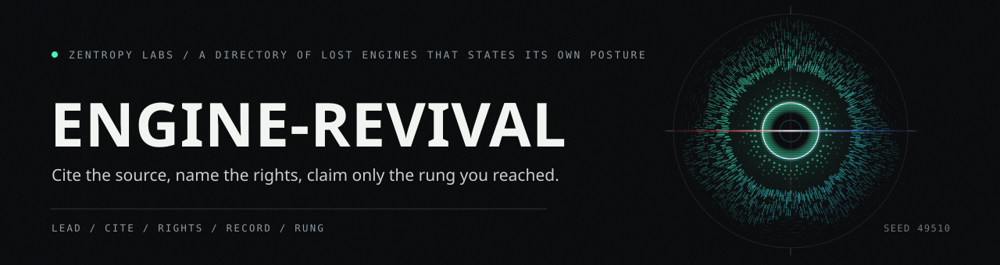

# engine-revival

Public tooling spine for reviving historical game engines, SDKs, rendering
libraries, CGI toolkits, and studio technology lineages.



This repo publishes public-safe metadata, schemas, validation tools, target
matrices, generated summaries, and evidence packets. It does not publish
proprietary SDKs, leaked source, game assets, private donor files, private
contact data, credentials, restricted media, or upstream source snapshots.

## How a lead is triaged

![Eight stages taking a lost engine lead to a stated posture: lead, sources, liveness, rights, source, record, directory, posture. A lead starts as a name and a dead link. Sources are cited first, each carrying its own confidence rating, and eighty-five of them are cited across the corpus with sixty-eight rated high, sixteen moderate and one low. The archive then asks whether anybody still maintains the project, and eight of them are still maintained, so the directory links the maintainer instead of forking the code. Rights come next: a license, a named rightsholder, or an unresolved posture that blocks any revival. The source itself is either released, reconstructable clean-room, or genuinely lost. Each lead becomes one JSON file whose id matches its filename, and the directory sorts it into hosted restoration, maintained upstream, buildable candidate, or dossier. Twenty-nine engine targets are tracked across nineteen categories. Three outcomes: a revival candidate whose source exists and whose rights allow the work, a lead recorded as a dossier with nothing buildable claimed, and a project the archive does not re-host because its maintainer is active.](docs/art/directory-lane.svg)

A project somebody still maintains is linked, not forked. A lead whose rights
are unresolved stays a dossier. The posture is part of the record.

## Current Public Boundary

BRender is the current flagship evidence lane. Engine Revival now preserves the
public BRender Archival v0.1.1 boundary:

- BRender Archival release commit:
  `11b5a8d539e911a9c07991b751402a7d51bf1bde`.
- Release tag: `v0.1.1`.
- PR: `HarperZ9/brender-archival#9`.
- Candidate contents: `bbf3ba2f26ee9ae265759e282dc1454b2234b6be`.
- Upstream public source snapshot:
  `foone/BRender-v1.3.2` at
  `d88d0ed41122664b9781015b517db64353e16f19`.
- Native verification: 21/21 CTest targets under Visual Studio Win32 Debug.
- Release media source run: `brender_core_softrend_render` over `dat/sph32.dat`
  with `final_frame_lit=19284 valid=true`.

Two build/evidence boundaries are intentionally separate:

- Engine Revival local 12-target portable materializer: public metadata and
  scaffold for the portable core ladder.
- External pinned BRender Archival v0.1.1 21-target release: public receipt
  imported from `HarperZ9/brender-archival` at commit
  `11b5a8d539e911a9c07991b751402a7d51bf1bde`.

The relationship boundary is explicit:

- Retro Engine equals play.
- Engine Revival equals preservation, research, metadata, and evidence.
- BRender Archival equals the verified specific BRender restoration.
- Generic Retro output is never BRender proof.

Engine Revival imports BRender Archival's public-safe receipt, transcript,
media, and provenance. It does not import local experimental branches, private
build trees, upstream source, binaries, or assets.

## Non-Claims

The BRender evidence packet does not claim completed textured TIA output, x64
readiness, production readiness, adoption, endorsement, or vendored upstream
source/assets. The experimental textured TIA path executes in BRender Archival,
but public release notes record black output from a measured
vertex-layout/state mismatch.

## The rung ladder

![Eight rungs taking a restored engine from dossier to a recovered title: dossier, source secured, build ladder, render parity, asset pipeline, game shell, remaster pass, lost-game recovery. The first rung records the lead and states its rights posture, claiming nothing buildable. The second pins authorized, license-verified source by commit or archive id. The third stands up a reproducible out-of-tree harness in which every rung self-verifies. The fourth matches reference frames to documented original output within a stated tolerance, and the fifth loads and renders original data formats from rights-clean assets. The sixth runs a title flow start to finish, the seventh reports measured gains such as resolution independence and float color, and the eighth makes a platform-lost title playable with provenance for every asset. Twenty-eight of the twenty-nine tracked targets sit at the first rung, twenty-one of them carrying a baseline readiness record and seven carrying none. The remaining engine carries imported evidence from a pinned external release, with a sanitized twenty-one target transcript and a readiness score of eighty-eight. Three outcomes: evidence imported for one engine, every other target still at the first rung, and neither a remaster pass nor a recovered title claimed anywhere.](docs/art/rung-lane.svg)

Each rung names the claim it earns and nothing above it. Twenty-eight of the
twenty-nine tracked targets sit at the first rung. Full rung definitions are in
the [remaster lane](docs/REMASTER-LANE.md).

## What the archive holds

![A table of twelve rows: what is in the archive, how many of it there are, and where each number is read from. Twelve record kinds are named in RECORD_DIRS, and three hundred and eighty-two JSON records sit across their directories, with sources leading at eighty-five and artifacts and accessions at sixty-six each. Twenty-nine engine targets span nineteen categories. Eighty-five sources are cited, sixty-eight of them rated high confidence, sixteen moderate and one low. Seven hundred and eighty-five references point from one record to another, and the validator resolves every one of them. Five artifacts are marked do-not-redistribute, and none of them carries a publishable access level. Twelve schemas name one hundred and fifteen required fields between them. The report command writes two hundred and thirty-five files and leaves the committed pages byte-identical. The local portable materializer generates eighteen files and twelve build targets, which is scaffold metadata and not the external twenty-one target release. Twenty-eight of the twenty-nine targets carry no rung claim above the first. One hundred and thirty-three Python tests cover the loaders, the validator, the reports, the audit, the materializer, and every number drawn here.](docs/art/corpus-table.svg)

Every count is read from the corpus or from the module that defines it. Rerun
the commands below and the numbers regenerate.

## First Workflow

```powershell
python -m pip install -e ".[test]"
engine-revival seed
engine-revival validate
engine-revival audit-public
engine-revival index
engine-revival report
python -m pytest
```

## BRender Evidence

- [BRender archival packet](docs/BRENDER-ARCHIVAL.md)
- [Sanitized 21-target transcript](attempts/transcripts/brender-v132-ctest-twentyone-targets-2026-08-27.log)
- [21-target attempt record](attempts/brender-v132-native-ctest-twentyone-targets-win32.json)
- [Release media provenance](gallery/release-20260827/provenance-manifest.json)
- [Period pipeline still](gallery/release-20260827/period-pipeline-still.png)
- [Period pipeline contact sheet](gallery/release-20260827/period-pipeline-orbit-contact-sheet.png)
- [Orbit frame sequence](gallery/release-20260827/orbit-frame-sequence.png)
- [Social card](gallery/release-20260827/social-card-1200x630.png)

## BRender Harness Metadata

```powershell
engine-revival materialize-brender-harness `
  --source-root C:\path\to\BRender-v1.3.2 `
  --output-root C:\path\to\brender-v132-portable-core-harness
```

This command is retained as public harness metadata and scaffolding. The
verified 21-target restoration boundary is not produced by this local
materializer in this patch. Use an explicit pinned external checkout recipe for
that receipt:

```powershell
git clone https://github.com/HarperZ9/brender-archival.git <brender-archival-v0.1.1>
git -C <brender-archival-v0.1.1> fetch --tags origin
git -C <brender-archival-v0.1.1> checkout 11b5a8d539e911a9c07991b751402a7d51bf1bde
git -C <brender-archival-v0.1.1> rev-parse HEAD
```

The final command must resolve to
`11b5a8d539e911a9c07991b751402a7d51bf1bde`. Engine Revival stores the public
receipt and provenance, not the external implementation checkout.

## Third-party notices

See [THIRD_PARTY_NOTICES.md](THIRD_PARTY_NOTICES.md). Engine Revival code is
MIT licensed. The upstream BRender source snapshot is recorded as MIT-licensed
source provenance and is not vendored here. Imported or derived BRender Archival
release media/transcript/provenance is treated as AGPL-3.0-or-later covered
third-party material unless verified asset-specific evidence grants otherwise.

## Public Docs

- [Revival mission](docs/REVIVAL-MISSION.md)
- [Lost engine directory](docs/DIRECTORY.md)
- [BRender archival packet](docs/BRENDER-ARCHIVAL.md)
- [Public boundary](docs/PUBLIC-BOUNDARY.md)
- [Recovery workflow](docs/RECOVERY-WORKFLOW.md)
- [Remaster lane](docs/REMASTER-LANE.md)
- [Generated public index](docs/generated/index.md)
- [Generated corpus database](docs/generated/database.json)
- [Generated targets](docs/generated/targets.md)
- [Generated sources](docs/generated/sources.md)
- [Generated artifacts](docs/generated/artifacts.md)
- [Generated accessions](docs/generated/accessions.md)
- [Generated tasks](docs/generated/tasks.md)
- [Generated milestones](docs/generated/milestones.md)
- [Generated reproductions](docs/generated/reproductions.md)
- [Generated snapshots](docs/generated/snapshots.md)
- [Generated production readiness](docs/generated/production-readiness.md)
- [Generated build environments](docs/generated/builds.md)
- [Generated harnesses](docs/generated/harnesses.md)
- [Generated attempts](docs/generated/attempts.md)
- [Generated coverage](docs/generated/coverage.md)
- [Generated rights summary](docs/generated/rights-summary.md)
- [Contributing](CONTRIBUTING.md)

---

**[Zentropy Labs](https://github.com/ZentropyLabs-ai)** · order out of entropy.
An independent lab building evidence-first tools that leave a re-checkable
artifact behind. Built by Zain Dana Harper in Seattle. The full workbench is at
[Project Telos](https://harperz9.github.io).
